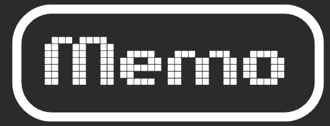

# Memo-v10
# Memo - Modern Flashcard Application



## Overview

Memo is a modern, intuitive flashcard application designed to revolutionize your learning experience. Whether you're a student tackling complex subjects or a language enthusiast expanding your vocabulary, Memo provides the perfect platform to create, customize, and review your flashcards.

## Features

### 🎯 Core Features
- **Create Custom Decks**: Build your own flashcard decks with unlimited cards
- **Ready-to-Use Decks**: Access pre-made decks for language learning and other subjects
- **Interactive Practice Sessions**: Engage with cards through an intuitive flip interface
- **Progress Tracking**: Monitor your learning progress with detailed statistics
- **Practice History**: Review your past performance and improvement over time

### 🎨 User Experience
- **Modern UI/UX**: Clean, pixel-art inspired design with smooth animations
- **Dark/Light Theme**: Toggle between themes for comfortable studying
- **Responsive Design**: Works seamlessly on desktop, tablet, and mobile devices
- **Customizable Settings**: Adjust font size, animation speed, and practice preferences

### 🔐 User Management
- **Firebase Authentication**: Secure user registration and login
- **Guest Mode**: Try the app without creating an account
- **Cloud Sync**: Your data syncs across devices when logged in
- **Local Storage Fallback**: Offline functionality when needed

### 📚 Content Management
- **Import/Export**: Import flashcards from text files or export your decks
- **Multiple Formats**: Support for tab-separated, line-separated, and colon-separated formats
- **Bulk Operations**: Manage multiple cards efficiently
- **Search & Filter**: Find specific decks and cards quickly

### 📊 Learning Analytics
- **Performance Metrics**: Track correct answers, wrong answers, and overall progress
- **Session Statistics**: View detailed results after each practice session
- **Best Scores**: Keep track of your highest scores for each deck
- **Time Tracking**: Monitor time spent on practice sessions
- **Review System**: Automatically review incorrectly answered cards

## Technology Stack

- **Frontend**: HTML5, CSS3, JavaScript (ES6+)
- **Styling**: Custom CSS with CSS Variables for theming
- **Icons**: Font Awesome 6.0
- **Fonts**: Press Start 2P (retro gaming style)
- **Backend**: Firebase (Authentication, Firestore Database)
- **Storage**: localStorage with Firebase sync
- **Responsive**: Mobile-first design approach

## Project Structure

```
memo/
├── index.html              # Landing page
├── login.html              # User authentication
├── signup.html             # User registration
├── my-decks.html           # Deck management
├── new-card.html           # Deck creation/editing
├── practice.html           # Practice sessions
├── settings.html           # App settings
├── about.html              # About page
├── account.html            # Practice history
├── styles/
│   ├── style.css           # Main styles
│   ├── my-decks.css        # Deck page styles
│   ├── practice.css        # Practice page styles
│   └── settings.css        # Settings page styles
├── scripts/
│   ├── firebase-config.js  # Firebase configuration
│   ├── firebase-auth.js    # Authentication logic
│   ├── account-management.js # User account handling
│   ├── auth-check.js       # Authentication verification
│   ├── theme-loader.js     # Theme management
│   ├── default-decks.js    # Pre-made content
│   └── firebase-decks.js   # Deck data operations
└── assets/
    ├── logo.png            # App logo
    └── me.jpeg             # Developer photo
```

## Getting Started

### Prerequisites
- Modern web browser (Chrome, Firefox, Safari, Edge)
- Internet connection for Firebase features
- No additional software installation required

### Installation
1. Clone or download the repository
2. Set up Firebase project:
   - Create a new Firebase project at [Firebase Console](https://console.firebase.google.com)
   - Enable Authentication and Firestore Database
   - Update `firebase-config.js` with your Firebase configuration
3. Open `index.html` in a web browser or deploy to a web server

### Quick Start
1. **Visit the App**: Open the application in your browser
2. **Create Account**: Sign up for a new account or continue as guest
3. **Explore Ready-to-Use Decks**: Try pre-made flashcard decks
4. **Create Your Own**: Use "New Deck" to create custom flashcards
5. **Start Practicing**: Click "Play" on any deck to begin learning

## Usage Guide

### Creating Flashcards
1. Navigate to "New Deck"
2. Enter deck name and description
3. Add cards with front and back content
4. Save your deck

### Practicing
1. Select a deck from "My Decks"
2. Click "Play" to start practice session
3. Tap cards to flip and reveal answers
4. Mark answers as correct/wrong or skip
5. Review results and track progress

### Importing Content
1. Go to "My Decks"
2. Click "Import Deck"
3. Upload a text file with your flashcards
4. Choose format (tab-separated, line-separated, etc.)
5. Preview and import

### Managing Settings
- **Theme**: Switch between dark and light modes
- **Font Size**: Adjust text size for better readability
- **Animations**: Control card flip speed and effects
- **Practice Options**: Customize shuffle settings

## File Formats for Import

### Tab-Separated Format
```
#separator:tab
Front Text	Back Text
Hello	Hola
Goodbye	Adiós
```

### Line-Separated Format
```
#separator:line
Front Text
Back Text
Hello
Hola
```

### Colon-Separated Format
```
Front Text:Back Text
Hello:Hola
Goodbye:Adiós
```

## Default Content

The app comes with several pre-made flashcard decks:
- **English B2 Level** - 100 advanced English words
- **English A2 Level** - 100 intermediate English words
- **Turkish History** - 50 important historical events
- **Spanish A1 Level** - 100 basic Spanish words
- **German A1 Level** - 100 basic German words
- **French A1 Level** - 100 basic French words
- **Italian A1 Level** - 100 basic Italian words

## Browser Compatibility

- ✅ Chrome 80+
- ✅ Firefox 75+
- ✅ Safari 13+
- ✅ Edge 80+
- ✅ Mobile browsers (iOS Safari, Chrome Mobile)

## Features in Detail

### Authentication System
- Firebase Authentication with email/password
- Guest mode for trying the app
- Automatic session management
- Secure data isolation per user

### Data Management
- Real-time sync with Firebase Firestore
- Offline functionality with localStorage
- Automatic conflict resolution
- Data export capabilities

### Practice Engine
- Smart card shuffling
- Progress tracking within sessions
- Automatic review of missed cards
- Performance analytics

## Privacy & Security

- User data is securely stored in Firebase
- Local data encryption where applicable
- No tracking of personal information beyond account data
- GDPR compliant data handling

## Contributing

This is a personal project by Mert Çağatay. For questions, suggestions, or issues:
- Email: mertcagatay4@gmail.com
- LinkedIn: [Mert Çağatay](https://www.linkedin.com/in/mert-%C3%A7a%C4%9Fatay-293b711b8/)

## License

This project is created for educational and personal use. All rights reserved by the developer.

## Roadmap

Future enhancements may include:
- Spaced repetition algorithm
- Collaborative deck sharing
- Advanced analytics dashboard
- Mobile app versions
- Additional content formats
- AI-powered content suggestions

## Support

For technical support or feature requests, please contact the developer at mertcagatay4@gmail.com.

---

**Made with ❤️ by Mert Çağatay** - Revolutionizing flashcard learning with modern web technology.
